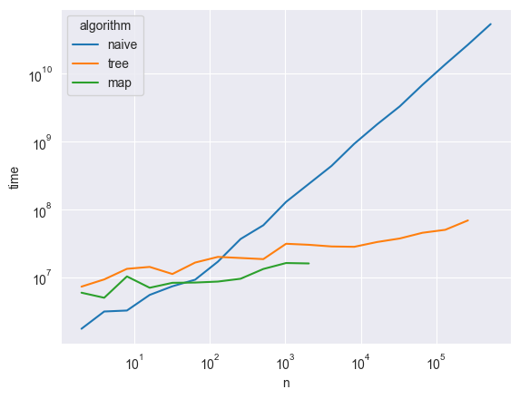

## Отчет по лабораторной №2

Реализованы 3 алгоритма для решения представленной задачи.

#### Первый алгоритм (наивный)
Не требует дополнительного времени для обработки данный, 
и отвечает на запрос для одной точки за линейное время от числа прямоугольников

```c++
int answer_for_point(const point &pt) override {
    int count = 0;
    for (auto &rect : rectangles) {
        if (rect.start.x <= pt.x and pt.x <= rect.end.x and
            rect.start.y <= pt.y and pt.y <= rect.end.y) {
            ++count;
        }
    }
    return count;
}
```

#### Второй алгоритм (построение карты)
Производит сжатие координат, затем строит карту в новых координатах, где точка на карте - 
это число прямоугольников покрывающих соответствующую область. Обработка выполняется за 
кубическое время от числа прямоугольников.
Ответ для одной точки можно получить за логарифмическое время.

##### Сжатие координат

```c++
static void construct_mapper(std::map<int, int> &mapper, const std::set<int> &points) {
    int new_cord = 0;
    for (const auto &old_cord: points) {
        mapper[old_cord] = new_cord;
        new_cord += 2;
    }
}

std::set<int> x_points, y_points;
for (const auto &rect : rectangles) {
    x_points.insert(rect.start.x);
    y_points.insert(rect.start.y);
    x_points.insert(rect.end.x);
    y_points.insert(rect.end.y);
}
construct_mapper(x_mapper, x_points);
construct_mapper(y_mapper, y_points);

```

##### Заполнение карты

```c++
counter = std::vector<std::vector<int>>( 2 * y_mapper.size() - 1, std::vector<int>( 2 * x_mapper.size() - 1, 0));
for (const auto &rect : rectangles) {
    int l = x_mapper[rect.start.x], r = x_mapper[rect.end.x] + 1;
    int u = y_mapper[rect.start.y], d = y_mapper[rect.end.y] + 1;
    for (int i = u; i < d; ++i) {
        for (int j = l; j < r; ++j) {
            counter[i][j]++;
        }
    }
}
```

##### Ответ для точки

```c++
static int compressed_cord(const std::map<int, int> &mapper, int cord) {
    auto equal_iter = mapper.find(cord);
    if (equal_iter != mapper.end()) {
        return equal_iter->second;
    }

    auto greater_iter = mapper.upper_bound(cord);
    if (greater_iter == mapper.begin() or greater_iter == mapper.end()) {
        -1;
    }
    return greater_iter->second - 1;
}
    
int answer_for_point(const point &pt) override {
    if (rectangles.empty()) {
        return 0;
    }
    auto y = compressed_cord(y_mapper, pt.y);
    auto x = compressed_cord(x_mapper, pt.x);
    if (x < 0 or y < 0) {
        return 0;
    }
    return counter[y][x];
}
```

#### Третий алгоритм (персистентное дерево с модификацией)
Также производит сжатие координат. Затем строится дерево отрезков, которое 
соответствует столбцу в карте, после чего создаются новые версии этого дерева.
В аналогии с картой индексы внутри дерева отрезков - это индексы по вертикальной оси.
А номера версий - это временная координата, которая соответствует индексу по горизонтальной оси.


##### Создание дерева и мапперов для координат
 
```c++
void apply_boundary_change(const boundary &b) {
        tree.add_range_modify(y_mapper[b.from], y_mapper[b.to] + 1, (b.is_opening ? 1 : -1));
    }
    
void create_version(
        std::vector<boundary>::iterator &it,
        const std::vector<boundary>::const_iterator &end,
        int cord,
        bool is_open
) {
    tree.copy_last_version();
    while (it < end and it->cord == cord and is_open == it->is_opening) {
        apply_boundary_change(*it);
        ++it;
    }
}
```
```c++
std::vector<boundary> x_points;
std::set<int> y_points;
for (const auto &rect : rectangles) {
    x_points.emplace_back(rect.start.x, true, rect);
    x_points.emplace_back(rect.end.x, false, rect);
    y_points.insert(rect.start.y);
    y_points.insert(rect.end.y);
}
construct_mapper(y_mapper, y_points);
std::sort(x_points.begin(), x_points.end());

tree.init(2 * (int) y_mapper.size() - 1);
auto it = x_points.begin();
while (it < x_points.end()) {
    int cord = it->cord;
    x_mapper[it->cord] = tree.count_versions();
    create_version(it, x_points.end(), cord, true);
    create_version(it, x_points.end(), cord, false);
}
```
##### Ответ для точки

```c++
int answer_for_point(const point &pt) override {
    if (rectangles.empty()) {
        return 0;
    }
    auto y = compressed_cord(y_mapper, pt.y);
    auto x = compressed_cord(x_mapper, pt.x);
    if (y < 0) {
        return 0;
    }
    return tree.get_version(x)->get_accumulated(y);
}
```

##### Код для дерева отрезков с модификацией

```c++
class SegTree {
    int delta = 0;
    int from = 0;
    int to = 0;
    std::shared_ptr<SegTree> left = nullptr;
    std::shared_ptr<SegTree> right = nullptr;

public:
    SegTree(const SegTree &root) = default;
    explicit SegTree(int index) : from(index), to(index + 1) {}
    SegTree(const std::shared_ptr<SegTree>& lef, const std::shared_ptr<SegTree> &rig, int d = 0) :
        left(lef), right(rig),
        from(lef->from), to(rig->to),
        delta(d) {}
        
    // complexity O ( n )
    static std::shared_ptr<SegTree> build(int from, int to) {
        if (from + 1 == to) {
            return std::make_shared<SegTree>(from);
        }
        int middle = (from + to) / 2;
        std::shared_ptr<SegTree> left_ = build(from, middle);
        std::shared_ptr<SegTree> right_ = build(middle, to);
        return std::make_shared<SegTree>(left_, right_);
    }

    // complexity O ( log n )
    int get_accumulated(int index, int prev_value = 0) const {
        int value = prev_value + delta;
        if (to - from == 1) {
            return value;
        }
        if (index < left->to) {
            return left->get_accumulated(index, value);
        } else {
            return right->get_accumulated(index, value);
        }
    }

    // complexity O ( log n )
    std::shared_ptr<SegTree> add_to_range(int l, int r, int num, const std::shared_ptr<SegTree> &shared_this) {
        if (to <= l or r <= from) {
            return shared_this;
        }
        if (l <= from and to <= r) {
            auto copy = std::make_shared<SegTree>(*this);
            copy->delta += num;
            return copy;
        }
        auto new_left = left ? left->add_to_range(l, r, num, left) : nullptr;
        auto new_right = right ? right->add_to_range(l, r, num, right) : nullptr;
        return std::make_shared<SegTree>(new_left, new_right, delta);
    }
};
```

#### Код реализаций лежит в файлах вида `/code/solutions/solution#`
Каждое решение наследовано от класса `AbstractSolver` и имеет 2 метода `void process()`,
отвечающий за препроцессинг и изменяющего состояние класса-решения, и метод 
`int answer_for_point(point)`, который вычисляет число прямоугольников, покрывающих данную точку.


### Тесты

Код использованный для генерации в файле `code/test_generation` в `namespace tests`

#### Генерация тестовых данных 

Тесты созданы по рекомендациям указанным в файле

```c++
std::vector<rectangle> generate_rectangles(int n) {
    std::vector<rectangle> result;
    for (int i = 0; i < n; ++i) {
        int s = 10 * i, e = 10 * (2 * n - i);
        result.push_back({{s, s}, {e, e}});
    }
    return result;
}

// calculates coordinate of point
int point_cord(int seed, int i, int n) {
    return (int) util::fast_pow_mod(seed * i, 31, 20 * n);
}

// creates a vector with points
std::vector<point> generate_points(int m, int n) {
    std::vector<point> result;
    int prime_x = 71, prime_y = 31;
    for (int i = 0; i < m; ++i) {
        result.push_back({point_cord(prime_x, i, n), point_cord(prime_y, i, n)});
    }
    return result;
}


void generate_all_tests(int from = 2, int to = 524288, int step = 2) {
    for (int i = from; i <= to; i *= step) {
        generate_test_file(i);
        std::cout << "created test for n = " << i << "\n";
    }
}
```

### Код запуска тестов
```c++
std::pair<long long, long long> test_solver_class(AbstractSolver &solver, std::ostream &os) {
    long long process_time = measure_method_executing_time([&solver]() {
        solver.preprocessing();
    });
    std::cout << "processed " << process_time << "\n";

    long long answer_time = measure_method_executing_time([&solver, &os]() {
        solver.solve(os);
    });
    std::cout << "answered " << answer_time << "\n";
    return {process_time, answer_time};
}

template <class T>
void create_table_with_results(const std::string &label, int to = 524288, int from = 2, int step = 2) {
    // create file and write header into .csv file
    auto table_file = files::open_file("tables/table_" + label + ".csv", std::ios::out);
    table_file << "n,algorithm,operation,time\n";

    for (int i = from; i <= to; i *= step) {
        std::cout << i << "\n";

        // construct a solver using given file
        auto file_in = files::open_test_file(i);
        T solver(file_in);
        file_in.close();

        // test the solver
        auto file_out = files::open_result_file(i);
        auto [t1, t2] = test_solver_class(solver, file_out);
        file_out.close();

        // write result to table
        table_file << i << "," << label << "," << "process" << "," << t1 << "\n";
        table_file << i << "," << label << "," << "answer" << "," << t2 << "\n";

        std::cout << "done\n";
    }
    table_file.close();
}

int main() {
    tests::generate_all_tests();
    create_table_with_results<Solver1>("naive");
    create_table_with_results<Solver3>("tree", 26144);
    create_table_with_results<Solver2>("map", 2048);
}
```

В результате были получены таблицы с замером времени выполнения алгоритмов
Дальнейший анализ и построение графиков проводился с помощью библиотек `pandas` и `seaborn` на python.
Код построения находится файле `graphs.ipynb`

Зависимость времени подготовки от числа прямоугольников
 


Зависимость времени ответа для 1000 точек от числа прямоугольников



## Выводы

Сложности реализованных алгоритмов соответствуют теоретическим сложностям, это можно видеть из полученных 
графиков.

Так как наивный алгоритм не требует времени для подготовки его хорошо использовать на небольших данных.
При _N <= 1000_ алгоритм работает быстрее всех. Однако при дальнейшем возрастании числа прямоугольников имеет смысл 
применять алгоритм на дереве. 

2ой способ является наименее предпочтительным на мой взгляд, так как из-за кубической сложности процесса подготовки
уже при _N ~ 500_ алгоритм работает ощутимо долго. А для того, чтобы собрать данные для числа прямоугольников более 
2000 у меня даже терпения не хватило.